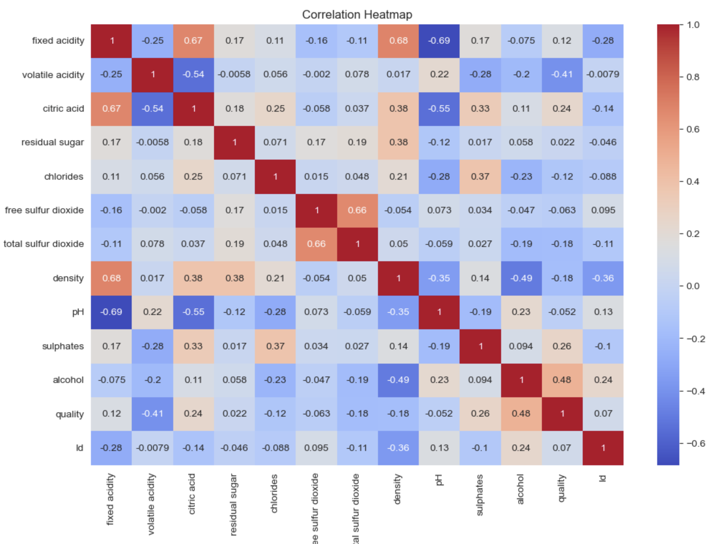
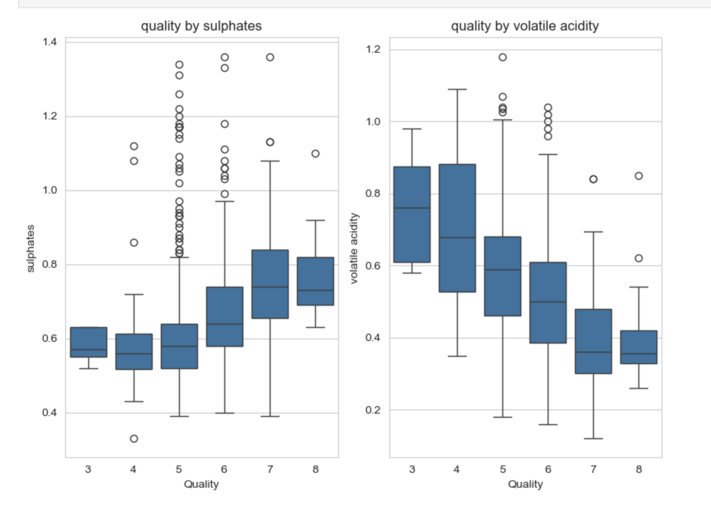
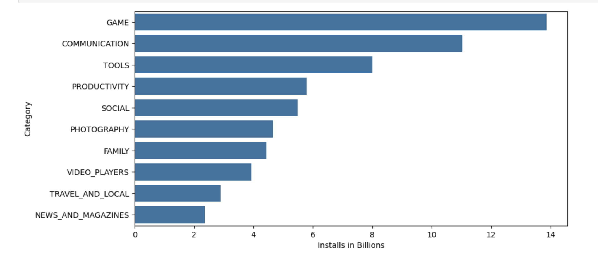
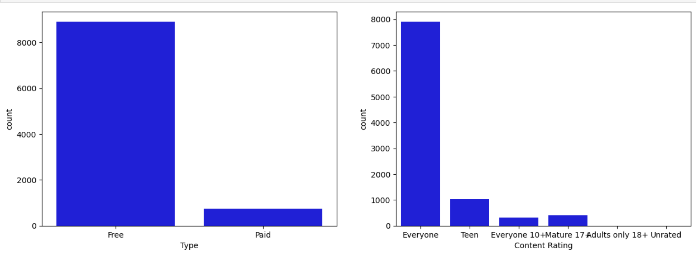

# Machine Learning with Python Notebooks

Welcome to my personal machine learning journey!  
This repository contains hands-on Jupyter Notebooks that I’ve created while learning Data Science and Machine Learning using Python.

Each notebook covers a different concept or dataset, from NumPy basics to Pandas operations, data merging, and real-life dataset explorations.

## 📌 Key Concepts Covered

- ✅ NumPy array creation, indexing, broadcasting
- ✅ Pandas DataFrame filtering, selection
- ✅ Merging, joining, and concatenating datasets
- ✅ Apply/lambda functions
- ✅ Handling CSV/Excel files
- ✅ Real datasets: Olympic Athletes, Wine Quality, Titanic, Google Play Dataset

## 📚 Technologies Used

- Python 3.x
- Jupyter Notebook
- NumPy
- Pandas
- Matplotlib & Seaborn
- Scikit-learn

## 🚀 Future Plans

- Add machine learning models (Linear Regression, Decision Trees, etc.)
- Start classification problems (Titanic, Iris, etc.)
- Explore feature engineering & model evaluation
- Clean notebooks with step-by-step markdown explanations

## 📸 Latest Project Preview

### 🍷 Wine Quality Dataset
EDA using Pandas, Seaborn, and Matplotlib.
Key tasks: Correlation heatmap, outlier filtering, boxplots, and scatter plots.

---

### 📱 Google Play Store Dataset
Exploration and feature engineering on real-world mobile app data.

**Kaan Cankaya**  
Cybersecurity + Data Science Student  
Melbourne, Australia 🇦🇺  
📬 [LinkedIn]https://www.linkedin.com/in/kaancnkya/

